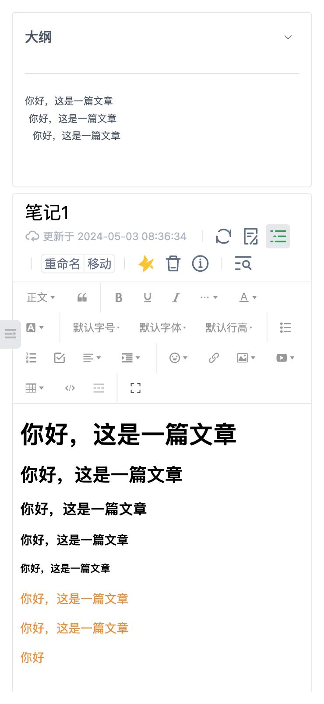
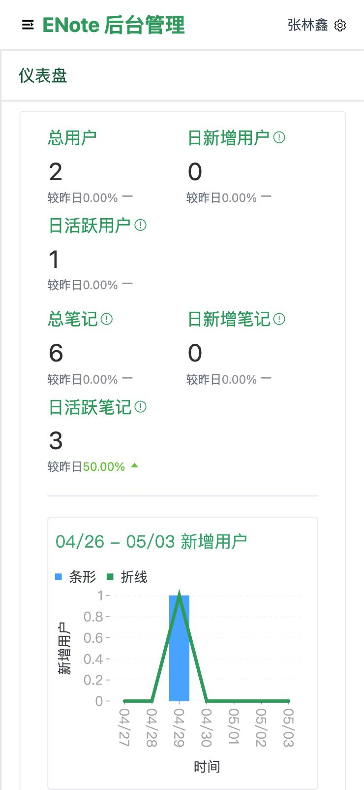
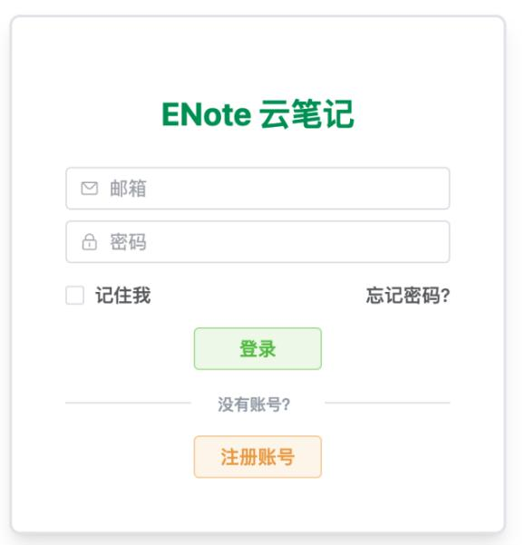
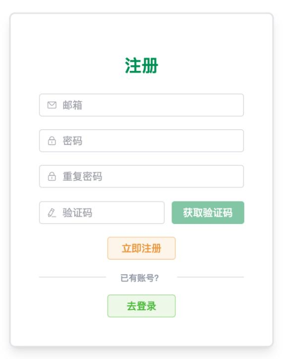

# ENote-Frontend
English | [中文](./README.zh-CN.md) 

This repository contains the frontend source code for the Cloud Note-Taking Platform, developed as part of an undergraduate thesis project. The platform provides users with a modern, responsive interface for creating, managing, and accessing notes across devices.

## Project Overview

This frontend application is built using the B/S architecture and a decoupled frontend-backend model. It aims to deliver a feature-rich, clean, and user-friendly cloud note-taking service. The application is built with the Vue 3 technology stack and implements a responsive layout compatible with both desktop and mobile browsers.

## Screenshots

**Desktop User Interface:**  


**Mobile User Interface:**  
</img>

**Desktop Admin Panel:**  


**Mobile Admin Panel:**  
</img>

**Login / Registration Screens:**  
</img>
</img>

## Features

### User Authentication
- User registration (with email verification)
- User login
- Forgot password (reset via email verification)
- "Remember me" auto-login (persistent tokens)
- Permission management (Regular User, Admin, Super Admin)
- User status management (Enable / Disable)

### Note Management
- Create / Delete / Rename notes
- Rich text editing (supports text, images, videos, audio – using WangEditor 5)
- Real-time / Auto-save content
- Note list view (summary, last updated time)
- Keyword search (fuzzy matching, case-insensitive)
- View note outline
- Favorite / Unfavorite notes
- Move notes between folders
- Add / Remove tags for notes

### Folder & Tag Management
- Create / Delete / Rename folders and tags
- Move folders
- Filter notes by folder, tag, favorite status, and keywords
- Context menu actions (for notes, folders, and tags) – powered by Vue3 Context Menu

### File Management
- Upload user avatars
- Upload / Access / Delete images, videos, and audio in notes  
  _(Deletions are synchronized with note content)_

### User Center
- View / Edit personal information (username, email, password, avatar)  
  _(Sensitive actions require email verification)_
- Delete account (email verification required)

### Data Analytics (User Side)
- Statistics on personal notes, folders, favorites, tags, and multimedia file counts
- Visual representation of personal storage usage (notes and media)

### Data Analytics (Admin Side)
- View total users, daily/weekly new users, daily/weekly active users with trends
- View total notes, daily/weekly new notes, daily/weekly active notes with trends
- View total media files (images / videos / audio), storage usage and trends
- Charts built with AntV G2

### Admin Panel
- User management (Create, Read, Update, Delete)  
  _(Admins cannot edit/delete users with equal or higher permission levels)_
- Platform data maintenance (Backup / Restore – UI simulation)

### Miscellaneous
- Responsive layout (adapts to both desktop and mobile)
- Clean and aesthetic UI (based on Element Plus and TailwindCSS)

## Technology Stack

- **Framework:** Vue.js 3 (Composition API)
- **Build Tool:** Vite
- **UI Library:** Element Plus
- **Router:** Vue Router
- **State Management:** Pinia
- **HTTP Client:** Axios
- **Rich Text Editor:** WangEditor 5
- **Data Visualization:** AntV G2
- **Context Menu:** Vue3 Context Menu
- **CSS Framework:** TailwindCSS
- **Core Language:** JavaScript (ES6+) / optionally TypeScript
- **Package Manager:** NPM / Yarn / PNPM

## Project Structure

```
enote-frontend/
├── public/
│   └── favicon.ico               # Website icon
├── src/
│   ├── assets/                   # Static assets (images, fonts, etc.)
│   ├── components/              # Reusable components (grouped by admin, auth, layout, user)
│   ├── router/                  # Route configuration (router.js)
│   ├── store/                   # State management (Pinia store.js)
│   ├── styles/                  # Global styles (style.css)
│   ├── utils/                   # Utility functions (constants, formatters, request wrappers, validators, etc.)
│   ├── views/                   # Page components
│   ├── App.vue                  # Root component
│   └── main.js                  # Application entry point
├── .env.development             # Environment variables for development (example)
├── index.html                   # HTML entry point
├── package.json                 # Project dependencies and scripts
├── vite.config.js               # Vite config file
└── tailwind.config.js           # TailwindCSS config
```

## Getting Started

### Prerequisites

- Node.js (recommended >=16.x)
- NPM, Yarn, or PNPM

### Installation and Run

1. **Clone the repository**
    ```bash
    git clone git@github.com:linxin4cs/enote-frontend.git
    cd enote-frontend
    ```

2. **Install dependencies**
    ```bash
    npm install
    # or
    yarn install
    # or
    pnpm install
    ```

3. **Configure environment variables**
    Create a `.env.development` file in the project root with the following content:

    ```env
    VITE_API_BASE_URL=http://localhost:8080/api
    ```
    _(Modify according to your backend address and port)_

4. **Run the development server**
    ```bash
    npm run dev
    # or
    yarn dev
    # or
    pnpm dev
    ```

    The app will be available at `http://localhost:5173` (or the port specified by Vite).

5. **Build for production**
    ```bash
    npm run build
    # or
    yarn build
    # or
    pnpm build
    ```

    The build output will be located in the `dist/` directory.

## API Interaction

This frontend application must interact with the corresponding **Cloud Note-Taking Platform Backend Service**. Ensure the backend service is running and that `VITE_API_BASE_URL` in `.env.development` is correctly configured.

Backend repository: [ENote-Backend](https://github.com/linxin4cs/enote-backend)
